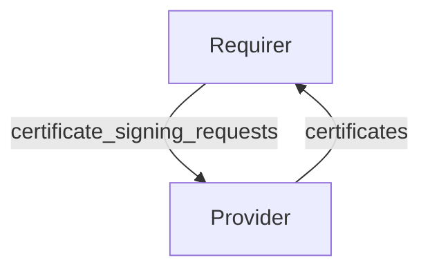

---
myst:
  html_meta:
    description: Document an interface in the charmlibs monorepo, including the specification README, metadata, schema, and interface tester tests.
---

(how-to-document-an-interface)=
# How to document an interface

Every interface library in the `charmlibs` monorepo is accompanied by an **interface specification**.
The specification is the source of truth for what it means for a charm to provide or require the interface, independent of any particular implementation, though we recommend charms use the official library for the interface.
It is published on the docs site under {ref}`Interface specifications <reference-interfaces>`.

```{tip}
This guide is for the **interface specification** -- the low-level contract defined in `interfaces/<name>/interface/`.
For library documentation targeting charm authors, like tutorials, how-to guides, and explanations, follow {ref}`how-to-add-library-docs` instead.
```

## Where the specification lives

The low-level interface specification has its own directory under the top-level directory for the interface:

```text
interfaces/<interface-name>/
├── interface/
│   ├── README.md       # The specification (rendered in the docs site).
│   ├── interface.yaml  # Machine-readable metadata.
│   └── schema.py       # Pydantic schemas for the relation data.
├── src/charmlibs/interfaces/<interface_name>/
│   └── ...             # The library implementation.
├── testing/            # The library's testing package.
└── ...
```

## Write the specification README

The `README.md` file is the heart of the specification. It is rendered verbatim on the docs site (under {ref}`reference-interfaces`).

Relative links to files in the repository are rewritten to GitHub URLs by the docs build. Absolute URLs are preserved as-is, and should be used for links to PyPI and Charmhub. Intersphinx links are not currently supported, so link to other documentation should use absolute URLs as well.

Start the README with a top-level heading of the form `# <interface-name>`, and a short paragraph explaining what the interface is for and which library charm authors should use to implement it, linking to the recommended `charmlibs.interfaces.<name>` package on PyPI.

Then add the following sections.

### Direction

Describe the provider/requirer (or requirer/provider) flow.
A Mermaid `flowchart` showing which side writes what data is the established convention, for example:

````markdown

````

### Behavior

List the expectations for each side of the relation, under `### Requirer` and `### Provider` subheadings. Use bullets phrased as "Is expected to ...". These are the criteria a charm must meet to be considered compatible with the interface. These criteria should be the source of truth for validators written to check compliance with interfaces, and must be kept up-to-date with library behaviour.

### Relation data

Document the contents of the application and unit databags for each side at a high level. This should be the final section in the document. The JSON or Pydantic schemas defined in the `interface/` directory will rendered below the high-level description in the docs. Populate the examples fields in your Pydantic schemas to have them rendered here.

## Write the interface metadata

The `interface.yaml` file holds machine-readable metadata about the interface version.
It is consumed by tooling and displayed on the interface listing.

```yaml
name: tls-certificates
version: 1
status: published
lib: charmlibs.interfaces.tls_certificates
summary: Securely request TLS certificates.
description:
  The `tls-certificates` interface allows charms to securely request and receive TLS certificates.
  The requirer charm is responsible for its private key and defining its certificate signing requests (CSRs).
  The provider charm delivers the certificate for each request, including the CA chain and CA certificate.

providers: []
requirers: []

maintainer: tls
```

Use these fields:

| Field | Description |
|-------|-------------|
| `name` | The interface name, exactly as it appears in `charmcraft.yaml`. |
| `version` | The major version of this interface, recorded for historical purposes for existing interfaces. New interfaces should use version 1. |
| `status` | One of `draft`, `published`, or `retired`. Use `draft` for work in progress, `published` for a released interface, and `retired` for interfaces that are no longer recommended for use. |
| `lib` | The import path of the recommended `charmlibs.interfaces.<interface name>` library, when one exists. Otherwise the identifier for the legacy Charmhub-hosted library, without its version specifier: `charms.<charm>.<lib name>`. |
| `summary` | A one-line description without special markup, shown in the interfaces table on Charmhub. |
| `description` | A longer description, interpreted as markdown, and shown on the interface page on Charmhub. |
| `providers` | A list of charms that provide the interface, each with `name` (the charm's name in `charmcraft.yaml`) and `url` (the Git repository where the charm is defined). May be empty. |
| `requirers` | A list of charms that require the interface, in the same format. May be empty. |
| `maintainer` | The team responsible for the interface (for example `tls`, `observability`). This should typically match the `CODEOWNERS` entry for this interface. |

## Write the schema

The `schema.py` file defines the relation data format using [Pydantic](https://docs.pydantic.dev/) models or Python stdlib `dataclasses`.
You may provide up to four such classes, for the matrix of provider/requirer and app/unit relation data.
These must have exactly the names `ProviderAppData`, `ProviderUnitData`, `RequirerAppData` and `RequirerUnitData`.
Not defining a model is equivalent to defining an empty model, so be careful of typos.

Follow the design rules from {ref}`how-to-design-relation-interfaces` when designing the schema:
no mandatory top-level fields, no field reuse, stable collection ordering, and so on.
The schema is the machine-checkable counterpart to the prose in the README.

```{note}
Older interface versions may use JSON Schema files under a `schemas/` directory instead of a `schema.py` file.
New interface versions should use a `schema.py` file with Pydantic models.
```

## Keep the specification in sync

The specification is a long-lived contract.
When you change the relation data format, update the README, the schema, and the interface tester tests together in the same PR, being sure to follow {ref}`how-to-design-relation-interfaces`:

- **Adding a field** is a minor change; bump at least the library's minor version.
- **Removing a field** or changing a field's type is a breaking change and requires a major library version bump. Note that charms on the other end of a given relation may use an older library version, so the library must be tolerant of this: older versions should handle unknown fields appropriately, while newer versions must be able to gracefully handle new fields being ignored.
