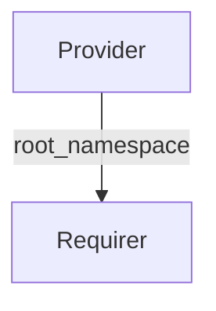

# `istio_metadata/v0`

## Overview

The `istio_metadata` interface lets an **Istio control plane charm** share information about its installation with charms that need to interoperate with Istio. The provider publishes a small piece of metadata (currently the root namespace where Istio is installed); requirers read it to configure their integration with Istio.

## Direction

This is a unidirectional interface where the provider sends data and the requirer only receives data. There is no data sent back from the requirer side.



## Behavior

- **Provider (Istio control plane charm)**: Publishes the metadata to the application data bag, typically on `leader_elected` and on this relation's `relation_joined` events. Only the leader unit may write the application data bag.
- **Requirer**: Consumes the metadata when the relation is populated. The requirer is expected to use `limit: 1` for this relation, since the metadata describes a single Istio installation.

## Relation Data

[\[Pydantic Schema\]](./schema.py)

On the provider side, the application data bag must contain the following field:

- `root_namespace` (string, required): The root namespace where Istio is installed (for example, `istio-system`).

### Provider

#### Example

```yaml
  application-data:
    root_namespace: istio-system
```

### Requirer

N/A
