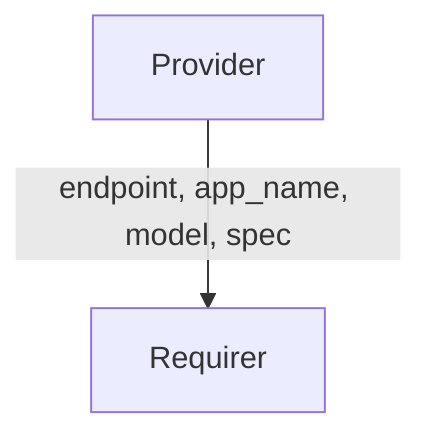

# `k8s_backup_target/v0`

## Overview

The `k8s_backup_target` interface enables a **client charm** to specify what Kubernetes data should be backed up by relating to a **backup charm or backup integrator charm**. In practice, a client charm declares the namespaces and resource types to include or exclude in backups, and the backup charm or integrator uses this specification to forward backup requests to a backup operator. This design lets the client define backup requirements **without direct cluster elevated permissions**, delegating the backup execution to the backup operator charm.

## Direction

This is a unidirectional interface where the provider (client) sends data and the requirer (backup charm or backup integrator) only receives data. There is no data sent back from the requirer side.



## Behavior

- **Provider (Client Charm)**: Provides the backup specification via its application relation data. Typically, a client charm will set this data as soon as the relation is formed.
- **Requirer (Backup Charm or Backup Integrator Charm)**: Consumes the spec. It does not send any data over the relation. If the requirer is an integrator charm, it should listens for changes to the relation data and forward the received spec to the backup operator it is related to.

## Relation Data

[\[Pydantic Schema\]](./schema.py)

On the provider side, the application data bag must contain structure with the following fields:

- `app` (string, required): Name of the client application that requires backups.
- `relation_name` (string, required): Name of the relation on the client side through which this spec is sent (from metadata.yaml).
- `model` (string, required): Name of the model where the client application is deployed.
- `spec` (dict, required): A dictionary defining what to back up. The spec structure is based on [Velero's resource filtering model](https://velero.io/docs/main/resource-filtering/) but is designed to be generic enough for alternative backup providers in future. This includes the following keys:
  - `include_namespaces` (list of str, optional): Specific Kubernetes namespaces to include in the backup. If not provided (None), all namespaces are included.
  - `include_resources` (list of str, optional): Specific Kubernetes resource kinds to include in the backup. If not provided (None), all resource types are included.
  - `exclude_namespaces` (list of str, optional): Namespaces to exclude from the backup.
  - `exclude_resources` (list of str, optional): Resource kinds to exclude from the backup.
  - `include_cluster_resources` (bool, optional): Whether to include cluster-scoped resources in the backup.
  - `label_selector` (dict, optional): A label selector to filter resources for backup.
  - `ttl` (string, optional): Time-to-live duration for the backup (e.g., "72h", "30d").

### Provider

#### Example

```yaml
  application-data:
    app: my-app
    relation_name: backup
    model: my-model
    spec:
        include_namespaces: ["my-namespace"]
        include_resources: ["persistentvolumeclaims", "services", "deployments"]
        exclude_resources: null
        exclude_namespaces: null
        label_selector: {"app": "my-app"}
        include_cluster_resources: false
        ttl: "24h"
```

### Requirer

N/A
