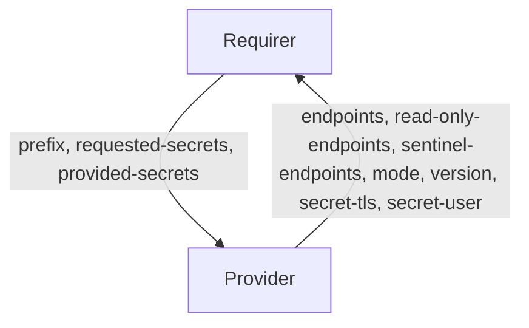

# `valkey_client/v1`

## Usage

This relation interface describes the expected behaviour of any charm interfacing with [Valkey Operator](https://github.com/canonical/valkey-operator) using the `valkey-client` relation.

In most cases, this will be accomplished using the [data_interfaces library](https://pypi.org/project/dpcharmlibs-interfaces/), although charm developers are free to provide alternative libraries as long as they fulfil the behavioural and schematic requirements described in this document.

## Direction

If this interface implements a provider/requirer pattern, describe the directionality of the relation and its meaning.
It would be good to have a mermaid chart to explain further:



As with all Juju relations, the `valkey-client` interface consists of two parties: a Provider (Valkey charm), and a Requirer (application charm). The Requirer will be expected to provide the range of keys accessed. The Provider will provide the endpoints the client can use to access the database, the username of the user created, the CA that issues the server certificate, and the version of the Valkey database.

## Behavior

Both the Requirer and the Provider need to adhere to criteria to be considered compatible with the interface.

Sensitive information is transmitted through Juju Secrets rather than directly through the relation data bag(s). Corresponding pieces of information are grouped together in a single secret.

Both the Provider and Requirer need to support Juju Secrets, an error will be raised on the initialization of the relation if any of them do not.

### Provider

- Is expected to provide the `endpoints` field containing all read-/write-endpoints in a comma-separated list.
- Is expected to provide the `read-only-endpoints` field containing all read-only-endpoints in a comma-separated list.
- Is expected to provide the `sentinel-endpoints` field containing all endpoints of Valkey Sentinel in a comma-separated list, if available.
- Is expected to provide the `username` and `password` as fields of a Juju secret and provide its URI in the `secret-user`.
  - The `username` field is expected to contain the username of the user created for the Requirer.
  - The `password` field is expected to contain the password of the user created for the Requirer.
- Is expected to provide the `version` field describing the installed version number of Valkey.
- Is expected to provide the `mode` field containing the High Availability mode of Valkey (can only be `sentinel` currently).
- Is expected to provide the TLS related information as fields of a Juju secret and provide its URI in the `secret-tls`.
  - The `tls` field is expected to contain whether TLS is enabled or not.
  - The `tls-ca` field is expected to contain the CA certificate of the server.
- Is expected to create a user and password for each request issued by the Requirer.
- Is expected to create read and write permissions for the keys prefix provided by the Requirer.
- Is expected to delete the user and permissiosn when the relation is removed.

### Requirer

- Is expected to provide `requested-secrets`, which is a list of field names that are not to be exposed on the relation databag, but handled within Juju Secrets. It should be JSON parsable array of strings, and correspond to valid Juju Secret keys (i.e. alphanumerical characters with a potential '-' (dash) character). By default the secret fields include `username`, `password`, `tls`, and `tls-ca`.
- Is expected to provide the `prefix` field containing the range of keys and message channels (Pub/Sub) accessed by the client.

## Relation Data

Describe the contents of the databags, and provide schemas for them.

[\[Pydantic Schema\]](./schema.py)

### Example

The Valkey operator supports both the `v1` and the `v0` of the `data-interfaces` library.

v1:

```yaml
requirer:
  application-data:
    requests: '[{"resource": "application:*", "request-id": "836763deea236532",
      "salt": "xqbPuYzzl2iiKeyN"}]'
    version: v1
provider:
  application-data:
    requests: '[{"resource": "application:*", "request-id": "836763deea236532",
      "salt": "xqbPuYzzl2iiKeyN", "endpoints": "valkey-1.valkey-endpoints:6379",
      "read-only-endpoints": "valkey-0.valkey-endpoints:6379,valkey-2.valkey-endpoints:6379",
      "secret-user": "secret://bc7400b7-2fce-41dd-8509-14a984455cda/d7fmpmvmp25c7618tfb0",
      "secret-tls": "secret://bc7400b7-2fce-41dd-8509-14a984455cda/d7fmpmvmp25c7618tfbg",
      "version": "9.0.1", "mode": "sentinel",
      "sentinel-endpoints": "valkey-0.valkey-endpoints:26379,valkey-1.valkey-endpoints:26379,valkey-2.valkey-endpoints:26379"}]'
    version: v1
```

v0:

```yaml
requirer:
  application-data:
    database: application:*
    requested-secrets: '["username", "password", "tls", "tls-ca"]'
provider:
  application-data:
    database: application:*
    endpoints: valkey-1.valkey-endpoints:6379
    mode: sentinel
    read-only-endpoints: valkey-0.valkey-endpoints:6379,valkey-2.valkey-endpoints:6379
    resource: application:*
    salt: azApUR5VGy94ABXj
    secret-tls: secret://bc7400b7-2fce-41dd-8509-14a984455cda/d7fmtknmp25c7618tfdg
    secret-user: secret://bc7400b7-2fce-41dd-8509-14a984455cda/d7fmtknmp25c7618tfd0
    sentinel_endpoints: valkey-0.valkey-endpoints:26379,valkey-1.valkey-endpoints:26379,valkey-2.valkey-endpoints:26379
    version: 9.0.1
```
